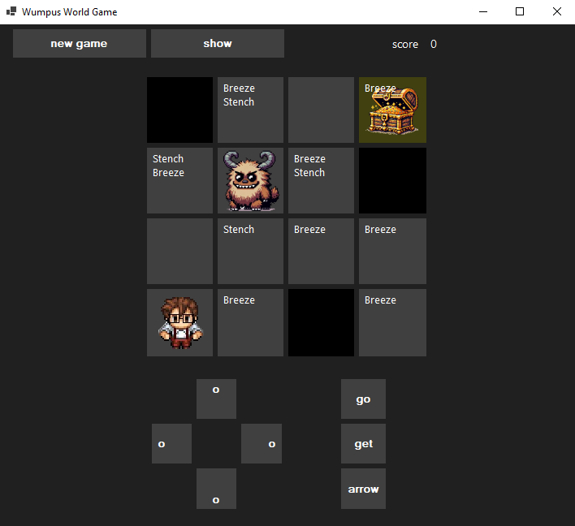
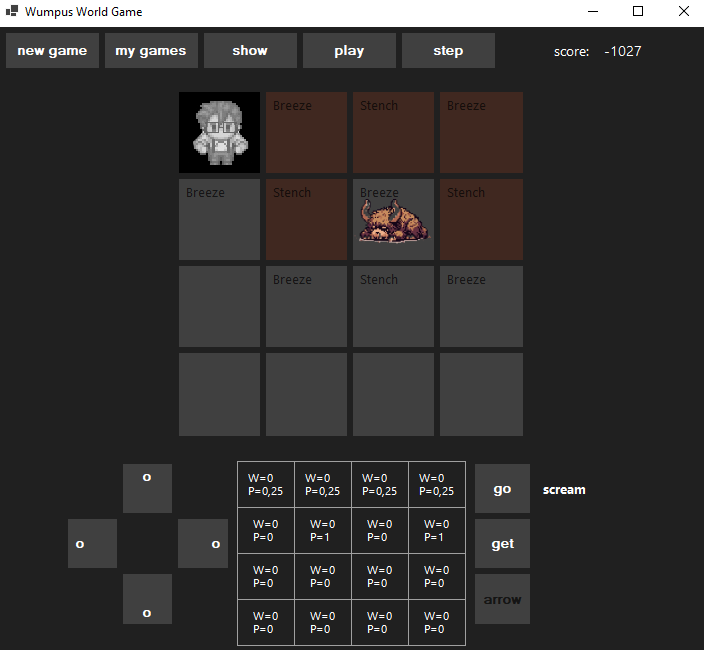
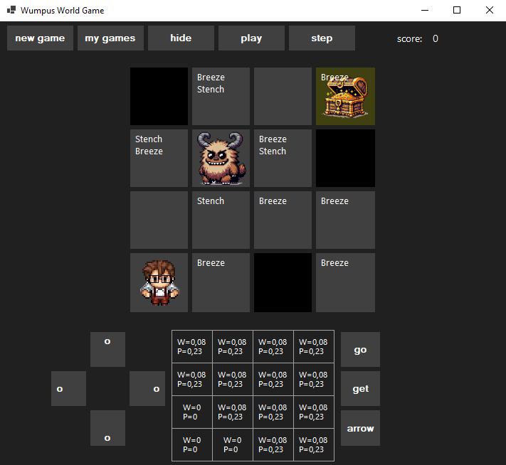
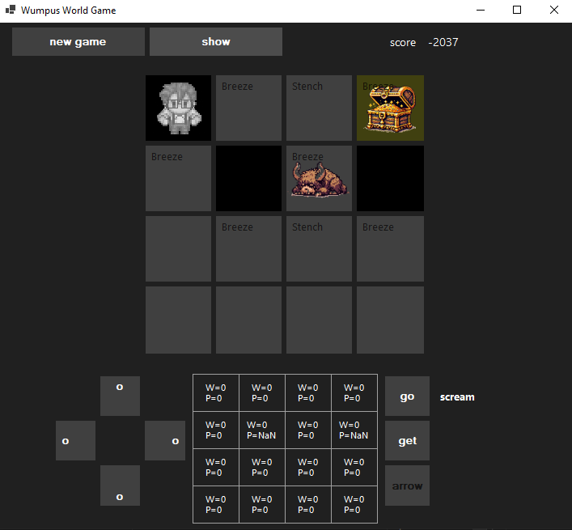

# Wumpus World

🌍 *[**Português**](README.md) ∙ [English](README_en.md)*

Wumpus World é um jogo baseado no famoso problema lógico em inteligência artificial. O jogador navega por um mundo de grade, tentando evitar perigos como poços e o terrível Wumpus enquanto busca um tesouro de ouro. Neste repositório apresentamos uma implementação em C# com interface Windows Forms, onde o usuário pode jogar ou utilizar um agente inteligente para tentar resolver o jogo.

## O Jogo do Mundo de Wumpus

### Introdução

O Mundo de Wumpus é um jogo de tabuleiro simulado que serve como um ambiente de teste padrão para algoritmos de raciocínio e aprendizado em IA. O jogo foi introduzido por Gregory Yob em 1973 e, desde então, tornou-se um exemplo clássico usado para ensinar conceitos de IA, especialmente em lógica proposicional e raciocínio sob incerteza.

### Objetivo do Jogo

O jogador controla um agente (o explorador) cujo objetivo é encontrar um tesouro escondido em um mundo cavernoso e sair vivo. O mundo é composto por uma grade de salas conectadas por passagens. O jogador deve evitar ou neutralizar perigos como poços e o temido Wumpus, uma criatura que habita uma das salas.

### Regras do Jogo

1. **Ambiente de Grade**: O mundo é uma grade quadrada 4x4, onde cada quadrado pode conter um poço, o Wumpus, ouro, ou nada. As salas (células da matriz 4x4) são conectadas na vertical e na horizontal. O agente inicia na posição [1,1], que é a entrada e saída da caverna.

2. **Percepções**:
   - **Brisa**: Sentida em quadrados adjacentes a poços.
   - **Fedor**: Sentida em quadrados adjacentes ao Wumpus.
   - **Brilho**: O ouro está no mesmo quadrado.
   - **Batida**: O agente tentou se mover através de uma parede.
   - **Grito**: O Wumpus foi morto.

3. **Ações do Agente**:
   - **Mover-se** para frente.
   - **Virar à esquerda** ou **à direita**.
   - **Atirar** uma flecha na direção que está olhando (o agente tem apenas uma flecha).
   - **Pegar** o ouro.
   - **Sair** do mundo, uma vez que o ouro tenha sido coletado.

4. **Condições de Encerramento**:
   - O agente pega o ouro e sai da caverna.
   - O agente cai em um poço ou é devorado pelo Wumpus.
   - O agente decide deixar a caverna sem o ouro.

5. **Medida de Desempenho**:
   - **+1000** por pegar o ouro.
   - **-1000** se cair em um poço ou for devorado pelo Wumpus.
   - **-1** para cada ação executada.
   - **-10** pelo uso da flecha.

---

## Requisitos

- .NET 8.0
- SO Windows

## Instalação

1. Clone o repositório para o seu computador local usando `git clone`.
2. Abra a solução `WumpusWorld.sln` no Visual Studio.
3. Compile o projeto.
4. Execute o arquivo executável gerado a partir da pasta `bin/Debug` ou `bin/Release`.

---

## Uso

### Jogo Manual
- Use os botões de direção para mover o jogador pelo grid.
- O botão "Go" executa o movimento na direção atualmente selecionada.
- Use o botão "Get" para pegar o ouro se estiver na mesma célula.
- Use o botão "Arrow" para atirar uma flecha na direção atualmente selecionada.
- Pressione as teclas correspondentes para uma interação mais rápida:
  - `Setas` para mover.
  - `Enter` para "Go".
  - `Espaço` para "Get".
  - `A` para "Arrow".
- Dicas sensoriais como "Breeze" e "Stench" para indicar a proximidade de perigos.
- Tabela com distribuições de probabilidades de poços e Wumpus em cada célula.

### Jogo Automático

Um dos motivos do desenvolvimento deste projeto foi a vontade de implementar um agente inteligente para este problema clássico de IA. Na parte superior da interface gráfica, você encontrará os botões que permitem selecionar alguns dos jogos favoritos e executar o agente inteligente que controla o personagem em busca do melhor resultado para o jogo proposto. Os botões da parte superior da interface gráfica são:
														
- `new game`: Gera um novo jogo aleatório.
- `my games`: Alterna entre uma pequena coleção dos meus jogos favoritos.
- `show/hide`: Permite exibir os perigos do jogo e ocultá-los (durante o jogo, os perigos são ocultos).
- `play/stop`: Inicia ou para o modo automático.
- `step`: Executa o modo automático passo a passo.

---

## Sobre as Distribuições de Probabilidades

### Caso Particular do Wumpus

#### Definição de Adjacência de um Conjunto
Seja $C$ um subconjunto de células do tabuleiro $B$. O conjunto de adjacência $A = \text{adj}(C)$ é dado por todas as células adjacentes às células de $C$ nas direções acima, abaixo, à direita e à esquerda.

$$
A = \text{adj}(C) = \bigcup_{(i,j)\in C}\big\lbrace (i+1,j), (i-1,j), (i,j+1), (i,j-1)\big\rbrace
$$
  
#### Exemplo
Seja $C = \lbrace c_{1,1} \rbrace$, então $\text{adj}(C) = \lbrace c_{1,2}, c_{2,1} \rbrace$.

#### Definição de Subconjuntos
Definimos:
- $V$ o conjunto das células visitadas pelo jogador.
- $S$ o conjunto das células seguras por dedução.
- $S^c := B \setminus S$.
- $M$ o conjunto das células que indicam que há algum perigo na adjacência.
- $H := \big\lbrace H_{i,j} \in 2^B \mid H_{i,j} = \text{adj}(m_{i,j}) \cap S^c, \forall m_{i,j} \in M \big\rbrace$.

Note que $M \subset V \subset S$.

#### Probabilidades do Wumpus
$$
P(C_{i,j} = w \mid M, S) = 
\begin{cases} 
0, & \text{se } C_{i,j} \in S, \\
(||B|| - ||S||)^{-1}, & \text{se } H = \emptyset \text{ e } C_{i,j} \notin S, \\
||\bigcap H_{i,j}||^{-1}, & \text{se } H \neq \emptyset \text{ e } C_{i,j} \notin S.
\end{cases}
$$

A notação $||A||$ indica a cardinalidade do conjunto $A$.

Esse modelo é implementado na classe [WumpusProbabilityDistribution](WumpusProbabilityDistribution.cs). No entanto, esta foi substituída pela generalização a seguir.

### Generalização da Distribuição de Probabilidades

#### Definição
Denotamos por $\mathcal{C}^S_n$ o conjunto de todas as combinações possíveis de $n$ células de $S^c$ que podem conter $n$ perigos (sejam poços ou o Wumpus). Isto é,

$$
\mathcal{C}^S_n := \big\lbrace C \subset S^c \mid ||C|| = n \big\rbrace.
$$
  

Seja $M$ o conjunto das células já visitadas com indicação de perigo. Definimos o conjunto das configurações válidas por:

$$
V(\mathcal{C}^S_n) := \big\lbrace \mathbf{C} \in \mathcal{C}^S_n \mid \text{adj}(\mathbf{C})^c \cap M = \emptyset \big\rbrace. 
$$
  

Assim, cada configuração $\mathbf{C} \in V(\mathcal{C}^S_n)$ representa uma possível distribuição dos perigos indicados.

#### Probabilidade de Perigo

$$
P(C_{i,j} = p \mid M, S) = \begin{cases}
0, & \text{se } C_{i,j} \in S,\\
\frac{||\lbrace \mathbf{C} \in V(\mathcal{C}^S_n) \mid C_{i,j} \in \mathbf{C} \rbrace||}{||V(\mathcal{C}^S_n)||}, & \text{se } C_{i,j} \notin S.
\end{cases}
$$

Essa distribuição é implementada em [HazardProbabilityDistribution](HazardProbabilityDistribution.cs).

---

## Sobre o Agente Solucionador

O agente inteligente implementado para resolver o problema do Mundo de Wumpus segue um algoritmo baseado em probabilidades e regras para explorar o ambiente, evitar perigos e alcançar o objetivo de coletar o tesouro (ouro) e retornar à posição inicial. O algoritmo é composto pelas seguintes etapas principais:

#### 1. Inicialização
- **Construtores**: O agente recebe os objetos `Player`, `Board`, `HandlerInterfaceBoard` e `HazardProbabilityDistribution` para Wumpus e poços.
- **Atributos**: O agente mantém informações sobre a posição do jogador, o tabuleiro, distribuições de probabilidades de perigos, células visitadas, estado de caça ao Wumpus e possíveis posições do Wumpus.

#### 2. Execução de Passos (`Step`)
A cada passo, o agente executa a lógica de tomada de decisão:

- **Marcar como Visitado**: Marca a posição atual do jogador como visitada.
- **Atualizar Distribuições de Probabilidade**: Atualiza as distribuições de probabilidades para o Wumpus e os poços.
- **Verificar Tesouro**: Se o jogador está na posição do ouro e ainda não o pegou, ele coleta o ouro e calcula o caminho de volta à saída.
- **Retorno à Saída**: Se o jogador já pegou o ouro, ele segue o caminho calculado para retornar à posição inicial.
- **Exploração e Caça ao Wumpus**:
  - **Explorar Células Seguras**: O agente procura células seguras e inexploradas adjacentes para se mover.
  - **Caça ao Wumpus**: Se não há células seguras disponíveis e o Wumpus ainda está vivo, o agente entra no modo de caça ao Wumpus, tentando localizar e eliminar o Wumpus.

#### 3. Modo de Caça ao Wumpus
O algoritmo de caça ao Wumpus utiliza uma máquina de estados para gerenciar as diferentes etapas da caça:

- **Estado Nenhum**: Procura pela posição do Wumpus com probabilidade de 1.0. Se encontrada, prepara o caminho para uma posição adjacente.
- **Estado Caçando**: Segue o caminho preparado até a posição adjacente ao Wumpus.
- **Estado Atirando**: Atira a flecha na direção do Wumpus. Se o Wumpus estiver em uma posição incerta, escolhe aleatoriamente entre duas posições possíveis.
- **Estado Finalizado**: Atualiza a distribuição de segurança após o tiro e termina a caça.

#### 4. Métodos Auxiliares
- **Mover em Direção ao Destino (`Redirect`)**: Envia comandos de teclado para mover o jogador na direção do destino especificado.
- **Atualizar Distribuições de Probabilidade**: Calcula as probabilidades atualizadas para a presença do Wumpus e poços com base nas informações atuais do tabuleiro.
- **Buscar Posição do Wumpus (`FindWumpusPosition`)**: Procura por células no tabuleiro com probabilidade de 1.0 para o Wumpus.
- **Buscar Posições Possíveis do Wumpus (`TryFindPossibleWumpusPositions`)**: Identifica células com probabilidade de 0.5 para o Wumpus.
- **Preparar Caminho para Caça (`PreparePathToHunt`)**: Calcula o caminho mais curto até uma das células seguras adjacentes ao Wumpus.
- **Procurar Célula Segura e Inexplorada (`FindUnexploredSafeCell`)**: Identifica células seguras e inexploradas adjacentes ou próximas para explorar.
- **Obter Células Adjacentes (`GetAdjacentCells`)**: Retorna uma lista de células adjacentes a uma posição especificada.

### Considerações Finais
O agente inteligente combina a exploração baseada em regras e probabilidades com uma estratégia de caça ao Wumpus para maximizar suas chances de sucesso enquanto minimiza o risco de morte. A estrutura modular do código permite a extensão e refinamento das funcionalidades do agente.

---

## Futuras Melhorias e Experimentações

Para refinar as funcionalidades do agente inteligente no problema do Mundo de Wumpus, aqui estão algumas opções que pensamos em explorar:

### 1. Melhoria da Tomada de Decisão com Inferência Bayesiana
- **Inferência Bayesiana**: Implementar um mecanismo de inferência bayesiana para atualizar as distribuições de probabilidade com base nas observações do agente, como brisas e fedor. Isso pode melhorar a precisão das estimativas de perigo.

### 2. Planejamento Avançado
- **Planejamento com $A^*$ ou Dijkstra**: Usar algoritmos de busca de caminho mais sofisticados como A* ou Dijkstra para encontrar caminhos mais eficientes e seguros.
- **Simulação de Cenários**: Implementar a capacidade de simular movimentos futuros para avaliar o risco e a recompensa antes de tomar uma decisão.

### 3. Aprendizado e Adaptação
- **Aprendizado por Reforço**: Integrar técnicas de aprendizado por reforço para que o agente possa aprender políticas ótimas de exploração e caça ao longo do tempo.
- **Memorização de Experiências**: Permitir que o agente armazene e utilize experiências passadas para melhorar a tomada de decisão em situações semelhantes.

### 4. Robustez e Resiliência
- **Gerenciamento de Riscos**: Implementar estratégias de gerenciamento de riscos que permitem ao agente lidar melhor com a incerteza, como manter um histórico de células visitadas e perigos detectados.
- **Fallback Strategies**: Desenvolver estratégias de fallback para situações de alto risco, como a retirada para uma posição segura conhecida.

### 5. Interação com o Ambiente
- **Comunicação**: Adicionar uma interface de comunicação para receber dicas ou comandos de um usuário ou outro agente, se aplicável.
- **Exploração Colaborativa**: Se houver múltiplos agentes, permitir a cooperação e comunicação entre eles para explorar e resolver o ambiente de maneira mais eficiente.

### 6. Otimização de Performance
- **Multithreading**: Implementar multithreading para cálculos de probabilidade e busca de caminho para melhorar a performance do agente.
- **Perfilamento e Otimização**: Usar ferramentas de perfilamento para identificar e otimizar gargalos de desempenho no código.

### 7. Melhoria da Interface de Usuário
- **Feedback Visível**: Adicionar feedback visual para mostrar as células seguras, perigosas e as decisões do agente em tempo real.
- **Histórico de Decisões**: Manter um registro das decisões tomadas pelo agente e suas justificativas para facilitar a análise e depuração.

### 8. Estruturação e Organização do Código
- **Modularização**: Refatorar o código em módulos mais coesos, como separação de lógica de caça ao Wumpus, movimentação e atualização de probabilidades.
- **Testes Unitários**: Implementar uma suíte abrangente de testes unitários para garantir a corretude e facilitar a manutenção do código.

---

## Licença

Este projeto está licenciado sob a [Licença MIT](LICENSE).

---

## Contribuição

Contribuições são bem-vindas! Para contribuir:

1. Faça um fork do projeto.
2. Crie uma nova branch para suas modificações (`git checkout -b feature/AmazingFeature`).
3. Faça commit de suas alterações (`git commit -m 'Add some AmazingFeature'`).
4. Faça push para a branch (`git push origin feature/AmazingFeature`).
5. Abra um Pull Request.

---
