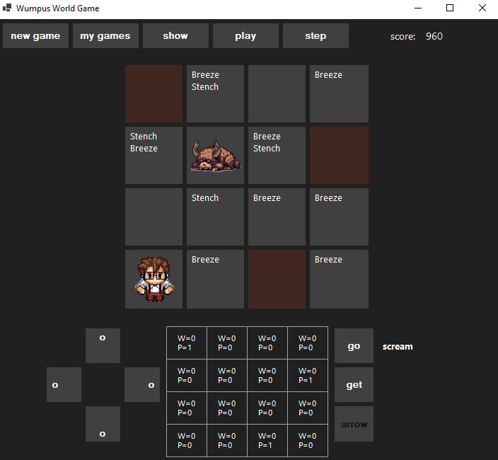

# Wumpus World

🌍 *[Portuguese](README.md) ∙ [**English**](README_en.md)*

Wumpus World is a game based on the famous logical problem in artificial intelligence. The player navigates through a grid world, trying to avoid dangers such as pits and the terrible Wumpus while searching for a gold treasure. In this repository, we present an implementation in C# with a Windows Forms interface, where the user can play or use an intelligent agent to try to solve the game.

## The Wumpus World Game

### Introduction

The Wumpus World is a simulated board game that serves as a standard testing environment for reasoning and learning algorithms in AI. The game was introduced by Gregory Yob in 1973 and has since become a classic example used to teach AI concepts, especially in propositional logic and reasoning under uncertainty.

### Game Objective

The player controls an agent (the explorer) whose goal is to find a hidden treasure in a cavernous world and escape alive. The world is composed of a grid of rooms connected by passages. The player must avoid or neutralize dangers such as pits and the feared Wumpus, a creature that inhabits one of the rooms.

### Game Rules

1. **Grid Environment**: The world is a 4x4 square grid, where each square can contain a pit, the Wumpus, gold, or nothing. The rooms (cells in the 4x4 matrix) are connected vertically and horizontally. The agent starts at position [1,1], which is the entrance and exit of the cave.

2. **Perceptions**:
   - **Breeze**: Felt in squares adjacent to pits.
   - **Stench**: Felt in squares adjacent to the Wumpus.
   - **Glitter**: The gold is in the same square.
   - **Bump**: The agent tried to move through a wall.
   - **Scream**: The Wumpus has been killed.

3. **Agent Actions**:
   - **Move** forward.
   - **Turn** left or right.
   - **Shoot** an arrow in the direction the agent is facing (the agent has only one arrow).
   - **Grab** the gold.
   - **Leave** the world once the gold has been collected.

4. **End Conditions**:
   - The agent grabs the gold and exits the cave.
   - The agent falls into a pit or is devoured by the Wumpus.
   - The agent decides to leave the cave without the gold.

5. **Performance Measure**:
   - **+1000** for grabbing the gold.
   - **-1000** if falling into a pit or being devoured by the Wumpus.
   - **-1** for each action taken.
   - **-10** for using the arrow.

---

## Requirements

- .NET 8.0
- Windows OS

## Installation

1. Clone the repository to your local machine using `git clone`.
2. Open the solution `WumpusWorld.sln` in Visual Studio.
3. Build the project.
4. Run the executable file generated in the `bin/Debug` or `bin/Release` folder.

---

## Usage

### Manual Game
- Use the direction buttons to move the player on the grid.
- The "Go" button executes the movement in the currently selected direction.
- Use the "Get" button to grab the gold if you are on the same cell.
- Use the "Arrow" button to shoot an arrow in the currently selected direction.
- Press the corresponding keys for faster interaction:
  - `Arrow keys` to move.
  - `Enter` to "Go".
  - `Space` to "Get".
  - `A` to "Arrow".
- Sensory hints like "Breeze" and "Stench" indicate the proximity of dangers.
- A table with the probability distributions of pits and the Wumpus in each cell.

### Automatic Game

One of the reasons for developing this project was the desire to implement an intelligent agent for this classic AI problem. At the top of the graphical interface, you will find buttons that allow you to select some of the favorite games and run the intelligent agent that controls the character in search of the best result for the proposed game. The buttons at the top of the graphical interface are:

- `new game`: Generates a new random game.
- `my games`: Switches between a small collection of my favorite games.
- `show/hide`: Allows you to show or hide the dangers of the game (during the game, the dangers are hidden).
- `play/stop`: Starts or stops the automatic mode.
- `step`: Executes the automatic mode step by step.

---

## About the Probability Distributions

### Particular Case of the Wumpus

#### Definition of Adjacency of a Set
Let $C$ be a subset of cells of the board $B$. The adjacency set $A = \text{adj}(C)$ is given by all cells adjacent to the cells of $C$ in the directions above, below, to the right, and to the left.

$$
A = \text{adj}(C) = \bigcup_{(i,j) \in C} \big\lbrace (i+1,j), (i-1,j), (i,j+1), (i,j-1) \big\rbrace
$$

#### Example
Let $C = \lbrace c_{1,1} \rbrace$, then $\text{adj}(C) = \lbrace c_{1,2}, c_{2,1} \rbrace$.

#### Definition of Subsets
We define:
- $V$ as the set of cells visited by the player.
- $S$ as the set of cells deduced to be safe.
- $S^c := B \setminus S$.
- $M$ as the set of cells indicating some danger in the adjacency.
- $H := \big\lbrace H_{i,j} \in 2^B \mid H_{i,j} = \text{adj}(m_{i,j}) \cap S^c, \forall m_{i,j} \in M \big\rbrace$.

Note that $M \subset V \subset S$.

#### Wumpus Probabilities
$$
P(C_{i,j} = w \mid M, S) = 
\begin{cases} 
0, & \text{if } C_{i,j} \in S, \\
(||B|| - ||S||)^{-1}, & \text{if } H = \emptyset \text{ and } C_{i,j} \notin S, \\
||\bigcap H_{i,j}||^{-1}, & \text{if } H \neq \emptyset \text{ and } C_{i,j} \notin S.
\end{cases}
$$

The notation $||A||$ indicates the cardinality of the set $A$.

This model is implemented in the class [WumpusProbabilityDistribution](WumpusProbabilityDistribution.cs). However, it has been replaced by the following generalization.

### Generalization of Probability Distribution

#### Definition
We denote by $\mathcal{C}^S_n$ the set of all possible combinations of $n$ cells of $S^c$ that can contain $n$ hazards (either pits or the Wumpus). That is,

$$
\mathcal{C}^S_n := \big\lbrace C \subset S^c \mid ||C|| = n \big\rbrace.
$$

Let $M$ be the set of cells already visited with an indication of danger. We define the set of valid configurations by:

$$
V(\mathcal{C}^S_n) := \big\lbrace \mathbf{C} \in \mathcal{C}^S_n \mid \text{adj}(\mathbf{C})^c \cap M = \emptyset \big\rbrace.
$$

Thus, each configuration $\mathbf{C} \in V(\mathcal{C}^S_n)$ represents a possible distribution of the indicated hazards.

#### Hazard Probability

$$
P(C_{i,j} = p \mid M, S) = \begin{cases}
0, & \text{if } C_{i,j} \in S,\\
\frac{||\lbrace \mathbf{C} \in V(\mathcal{C}^S_n) \mid C_{i,j} \in \mathbf{C} \rbrace||}{||V(\mathcal{C}^S_n)||}, & \text{if } C_{i,j} \notin S.
\end{cases}
$$

This distribution is implemented in [HazardProbabilityDistribution](HazardProbabilityDistribution.cs).

---

## About the Solver Agent

The intelligent agent implemented to solve the Wumpus World problem follows an algorithm based on probabilities and rules to explore the environment, avoid dangers, and achieve the goal of collecting the treasure (gold) and returning to the starting position. The algorithm consists of the following main steps:

#### 1. Initialization
- **Constructors**: The agent receives the objects `Player`, `Board`,

 `HandlerInterfaceBoard`, and `HazardProbabilityDistribution` for Wumpus and pits.
- **Attributes**: The agent keeps information about the player's position, the board, hazard probability distributions, visited cells, Wumpus hunting state, and possible Wumpus positions.

#### 2. Step Execution (`Step`)
At each step, the agent executes the decision-making logic:

- **Mark as Visited**: Marks the current position of the player as visited.
- **Update Probability Distributions**: Updates the probability distributions for the Wumpus and pits.
- **Check for Treasure**: If the player is at the gold's position and hasn't grabbed it yet, the agent grabs the gold and calculates the path back to the exit.
- **Return to Exit**: If the player has already grabbed the gold, the agent follows the calculated path to return to the starting position.
- **Exploration and Wumpus Hunting**:
  - **Explore Safe Cells**: The agent searches for adjacent safe and unexplored cells to move.
  - **Wumpus Hunting**: If there are no safe cells available and the Wumpus is still alive, the agent enters Wumpus hunting mode, trying to locate and eliminate the Wumpus.

#### 3. Wumpus Hunting Mode
The Wumpus hunting algorithm uses a state machine to manage the different stages of the hunt:

- **No State**: Searches for the Wumpus position with a probability of 1.0. If found, prepares the path to an adjacent position.
- **Hunting State**: Follows the prepared path to the position adjacent to the Wumpus.
- **Shooting State**: Shoots the arrow in the direction of the Wumpus. If the Wumpus is in an uncertain position, randomly chooses between two possible positions.
- **Finished State**: Updates the safety distribution after the shot and ends the hunt.

#### 4. Auxiliary Methods
- **Move Towards Destination (`MoveTowards`)**: Sends keyboard commands to move the player towards the specified destination.
- **Update Probability Distributions**: Calculates the updated probabilities for the presence of the Wumpus and pits based on the current board information.
- **Search for Wumpus Position (`FindWumpusPosition`)**: Searches for cells on the board with a probability of 1.0 for the Wumpus.
- **Search for Possible Wumpus Positions (`TryFindPossibleWumpusPositions`)**: Identifies cells with a probability of 0.5 for the Wumpus.
- **Prepare Path to Hunt (`PreparePathToHunt`)**: Calculates the shortest path to one of the safe cells adjacent to the Wumpus.
- **Search for Safe and Unexplored Cell (`FindUnexploredSafeCell`)**: Identifies safe and unexplored cells adjacent or close to explore.
- **Get Adjacent Cells (`GetAdjacentCells`)**: Returns a list of cells adjacent to a specified position.

### Final Considerations
The intelligent agent combines rule-based and probability-based exploration with a Wumpus hunting strategy to maximize its chances of success while minimizing the risk of death. The modular structure of the code allows for the extension and refinement of the agent's functionalities.

---

## Future Improvements and Experiments

To refine the functionalities of the intelligent agent in the Wumpus World problem, here are some options we plan to explore:

### 1. Improved Decision Making with Bayesian Inference
- **Bayesian Inference**: Implement a Bayesian inference mechanism to update probability distributions based on the agent's observations, such as breezes and stench. This can improve the accuracy of hazard estimates.

### 2. Advanced Planning
- **Planning with $A^*$ or Dijkstra**: Use more sophisticated pathfinding algorithms like A* or Dijkstra to find more efficient and safer paths.
- **Scenario Simulation**: Implement the ability to simulate future moves to evaluate risk and reward before making a decision.

### 3. Learning and Adaptation
- **Reinforcement Learning**: Integrate reinforcement learning techniques so the agent can learn optimal exploration and hunting policies over time.
- **Experience Memorization**: Allow the agent to store and use past experiences to improve decision-making in similar situations.

### 4. Robustness and Resilience
- **Risk Management**: Implement risk management strategies that allow the agent to better handle uncertainty, such as keeping a history of visited cells and detected hazards.
- **Fallback Strategies**: Develop fallback strategies for high-risk situations, such as retreating to a known safe position.

### 5. Environment Interaction
- **Communication**: Add a communication interface to receive hints or commands from a user or another agent, if applicable.
- **Collaborative Exploration**: If multiple agents are present, allow cooperation and communication between them to explore and solve the environment more efficiently.

### 6. Performance Optimization
- **Multithreading**: Implement multithreading for probability calculations and pathfinding to improve the agent's performance.
- **Profiling and Optimization**: Use profiling tools to identify and optimize performance bottlenecks in the code.

### 7. User Interface Improvement
- **Visible Feedback**: Add visual feedback to show safe cells, dangerous cells, and the agent's decisions in real-time.
- **Decision History**: Keep a record of the agent's decisions and their justifications to facilitate analysis and debugging.

### 8. Code Structuring and Organization
- **Modularization**: Refactor the code into more cohesive modules, such as separating Wumpus hunting logic, movement, and probability updates.
- **Unit Testing**: Implement a comprehensive suite of unit tests to ensure correctness and facilitate code maintenance.

---

## License

This project is licensed under the [MIT License](LICENSE).

---

## Contribution

Contributions are welcome! To contribute:

1. Fork the project.
2. Create a new branch for your modifications (`git checkout -b feature/AmazingFeature`).
3. Commit your changes (`git commit -m 'Add some AmazingFeature'`).
4. Push to the branch (`git push origin feature/AmazingFeature`).
5. Open a Pull Request.

---