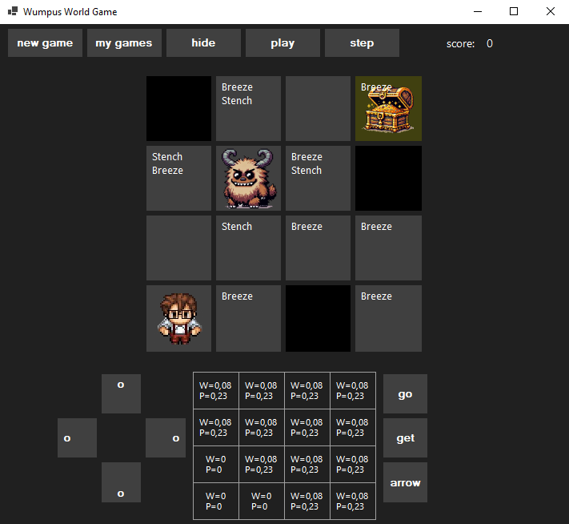

# Wumpus World

🌍 *[Portuguese](README.md) ∙ [English](README_en.md)*

Wumpus World is a game based on the famous logic problem in artificial intelligence. The player navigates through a grid world, trying to avoid dangers such as pits and the terrible Wumpus while searching for a treasure of gold.

## Description

In Wumpus World, the player moves a character through a 4x4 grid, where each cell may contain a danger or treasure. The objective is to find the gold and return to the starting point without falling into pits or being eaten by the Wumpus. The game is a great example of logical reasoning and decision-making under uncertainty.

### Features

- Simple graphical interface with buttons to control the player's movement and actions.
- Sensory hints like "Breeze" and "Stench" to indicate the proximity of dangers.
- Ability to shoot an arrow to kill the Wumpus.

 

## Requirements

- .NET 8.0
- Windows OS.

## Installation

1. Clone the repository to your local computer using `git clone`.
2. Open the `WumpusWorld.sln` solution in Visual Studio.
3. Compile the project.
4. Run the executable file generated from the `bin/Debug` or `bin/Release` folder.

## Usage

- Use the direction buttons to move the player through the grid.
- The "Go" button performs the move in the currently selected direction.
- Use the "Get" button to pick up the gold if it is in the same cell.
- Use the "Arrow" button to shoot an arrow in the currently selected direction.
- Press the corresponding keys for quicker interaction:
  - Arrows to move.
  - Enter for "Go".
  - Space for "Get".
  - A for "Arrow".

## Probabilities Matrix

## About Probability Distributions

#### Definition of Adjacency of a Set
Let $C$ be a subset of cells in the board $B$. The adjacency set $A = \text{adj}(C)$ is given by all cells adjacent to the cells in $C$ in the directions above, below, to the right, and to the left.

$$
A = \text{adj}(C) = \bigcup_{(i,j)\in C}\big\lbrace (i+1,j), (i-1,j), (i,j+1), (i,j-1)\big\rbrace
$$

#### Example
Let $C = \lbrace c_{1,1} \rbrace$, then $\text{adj}(C) = \lbrace c_{1,2}, c_{2,1} \rbrace$.

#### Definition of Subsets
We define:
- $V$ as the set of cells visited by the player.
- $S$ as the set of cells deduced to be safe.
- $S^c := B \setminus S$.
- $M$ as the set of cells indicating that there is some danger in the adjacency.
- $H := \lbrace H_{i,j} \in 2^B \mid H_{i,j} = \text{adj}(m_{i,j}) \cap S^c, \forall m_{i,j} \in M \rbrace$.

Note that $M \subset V \subset S$.

#### Wumpus Probabilities
$$
P(C_{i,j} = w \mid M, S) = 
\begin{cases} 
0, & \text{if } C_{i,j} \in S, \\
(||B|| - ||S||)^{-1}, & \text{if } H = \emptyset \text{ and } C_{i,j} \notin S, \\
||\bigcap H_{i,j}||^{-1}, & \text{if } H \neq \emptyset \text{ and } C_{i,j} \notin S.
\end{cases}
$$

The notation $||A||$ indicates the cardinality of set $A$.

This version was abandoned after the generalization below. However, if you want to see the implementation, it is done in the class [WumpusProbabilityDistribution](WumpusProbabilityDistribution.cs).

### Generalization of Probability Distribution

#### Definition
We denote by $\mathcal{C_n}$ the set of all possible combinations of $n$ cells from $S^c$ that can contain $n$ hazards (whether pits or the Wumpus). That is,

$$
\mathcal{C}^S_n:=\big\lbrace C\subset S^c \mid ||C||=n \big\rbrace.
$$

Let $M$ be the set of cells indicating danger. We define the set of valid configurations as:

$$
V(\mathcal{C}^S_n):=\big\lbrace \mathbf{C}\in\mathcal{C}^S_n \mid \text{adj}(\mathbf{C})^c\cap M = \emptyset \big\rbrace.
$$

Thus, each configuration $\mathbf{C} \in \mathcal{C_n}$ represents a possible distribution of the indicated hazards.

#### Hazard Probability

$$
P(C_{i,j}=p|M,S)=\begin{cases}
0, &\text{ se }C_{i,j}\in S,\\
\frac{||\lbrace\mathbf{C}\in V(\mathcal{C}^S_n) \mid C_{i,j}\in\mathbf{C}\rbrace||}{||V(\mathcal{C}^S_n)||}, &\text{ se }C_{i,j}\notin S.
\end{cases}
$$

This is the distribution implemented in [HazardProbabilityDistribution](HazardProbabilityDistribution.cs).
